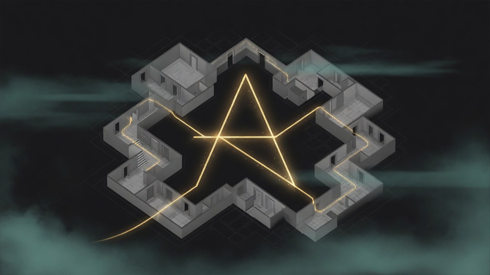
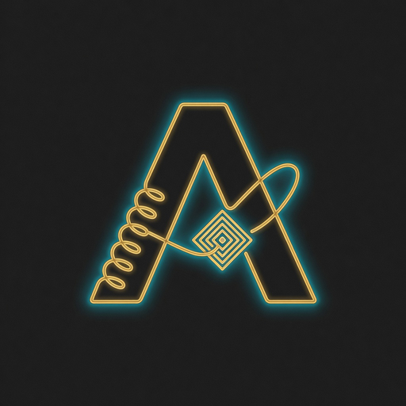
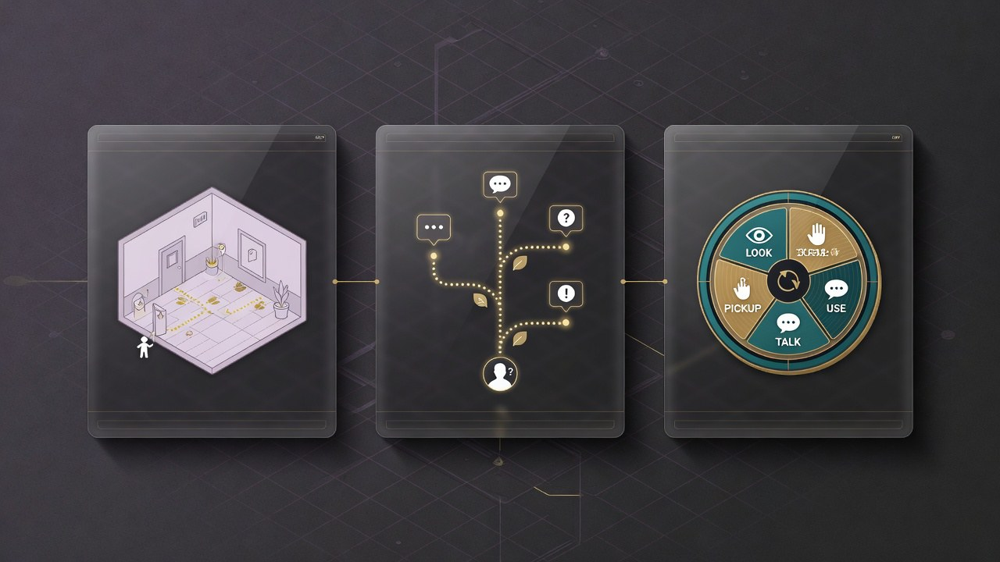
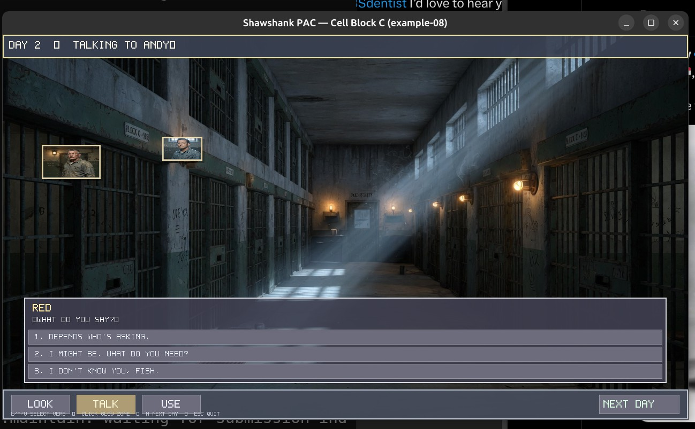
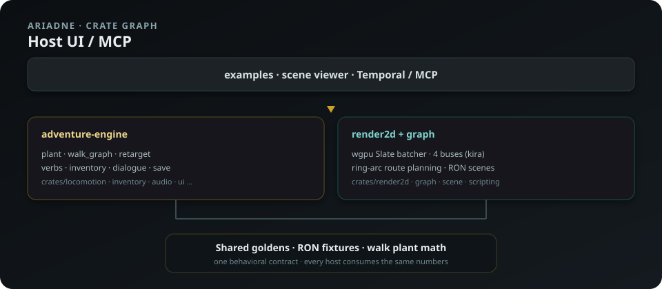
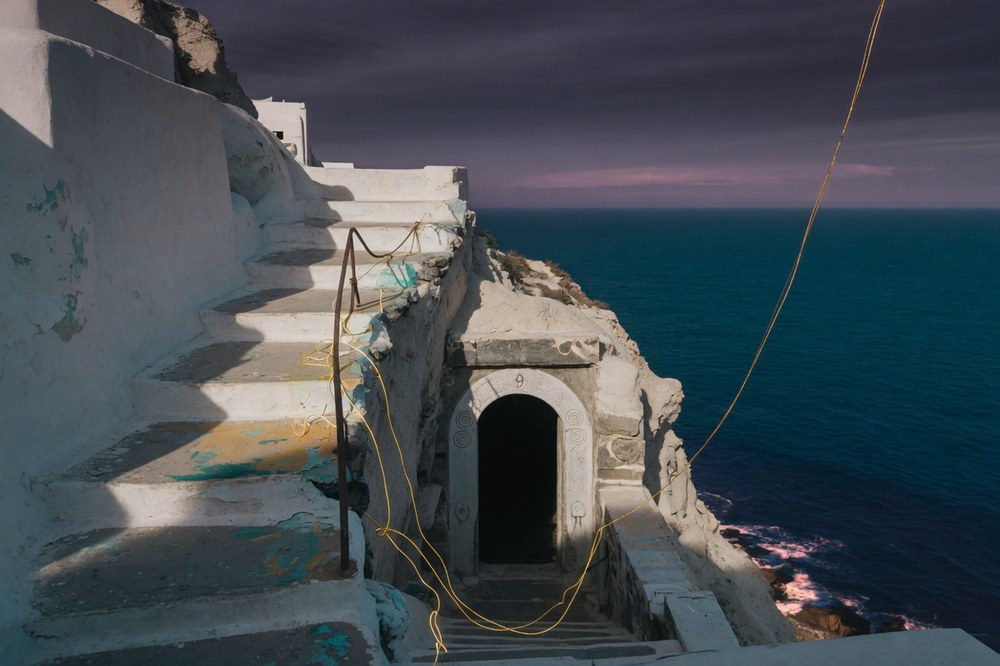

# Ariadne

<p align="center">
  
</p>

<p align="center">
  
</p>

> **Product name: Ariadne** — *thread through the labyrinth.*  
> Scrya’s native Rust point-and-click adventure runtime.  
> Docs: https://scrya.com/ariadne · Name note: [docs/NAME.md](docs/NAME.md)  
> **Source:** [github.com/scrya-com/adventure-engine](https://github.com/scrya-com/adventure-engine)

<p align="center">
  <a href="https://beta.scrya.com/scene/?play=1&room=shawshank"></a>
</p>

Repository directory name remains `adventure-engine` (crate paths) until a full rename.

## Snapshot

| | |
|---|---|
| **Runtime** | Rust workspace · wgpu · bevy_ecs (world only) · Rhai · RON |
| **Phases** | 0–7 done · 8–9 next |
| **Sister** | Flutter Scene at [beta.scrya.com/scene](https://beta.scrya.com/scene/?play=1&room=shawshank) |

<p align="center">
  
</p>

<p align="center"><sub>Walk graphs · dialog trees · verb coin — the thread that weaves playable systems.</sub></p>

## Example — Shawshank PAC (Cell Block C)

Playable SCUMM-style chrome on a full cellblock still: status strip, **LOOK / TALK / USE**, **NEXT DAY**, face-cropped hub portraits, door-aligned hotspots.

<p align="center">
  
</p>

```bash
cargo run -p example-08-shawshank-pac
```

Details: [`examples/08-shawshank-pac/README.md`](examples/08-shawshank-pac/README.md) · playtest notes: [`PLAYTEST.md`](examples/08-shawshank-pac/PLAYTEST.md).

## Clone & build

```bash
git clone git@github.com:scrya-com/adventure-engine.git
cd adventure-engine
cargo build --workspace
cargo test --workspace
cargo run -p example-08-shawshank-pac
```

---

# adventure-engine (repo)

A small, native Rust point-and-click adventure game engine.

Inspired by an architectural analysis of Unreal Engine 5.8 — keeping the load-bearing abstractions (slate-style element batcher, gameplay tags, streaming assets, versioned saves) while dropping everything irrelevant to 2D point-and-click (3D rendering, physics, networking, Blueprint VM, mark-sweep GC, cooking).

## Status

| Phase | Status | What lands |
|---|---|---|
| 0 — Foundation | **done** | repo, design docs, forked locomotion SDK, vendored graph math |
| 1 — Core + scene data model | **done** | RON scene format, gameplay tags, var table |
| 2 — Rendering | **done** | wgpu + Slate-style batcher (`examples/01`, `02`) |
| 3 — Input + interaction | **done** | click/hover dispatch, hotspot picking (`examples/03`) |
| 4 — Locomotion wired up | **done** | click-to-walk (`examples/04` + `engine`) |
| 5 — Dialog + UI | **done** | RON dialog trees + Rhai conditions (`examples/05-dialog`) |
| content pack | assets | Shawshank PAC stills (`examples/06-shawshank-pac`) — playable HTML in sibling [ncp](https://github.com/johndpope/ncp) repo |
| 6 — Audio + save | **done** | kira 4-bus mixer, versioned save files (`examples/06-audio-save`) |
| 7 — Inventory + verbs | **done** | items + combine + verb coin (`examples/07-inventory`) |
| 8 — Cutscenes + i18n | pending | timeline/sequencer, fluent-rs |
| 9 — Editor tooling | pending | asset packer, RON inspector |

See `docs/ROADMAP.md` for the full plan.

## Architecture

16-crate workspace under `crates/`. See `docs/ARCHITECTURE.md` for the dependency graph.

<p align="center">
  
</p>

**Foundation crates:**
- `core` — glam re-exports, AssetId, Error, tracing
- `locomotion` — forked from scene-engine (walk graphs, plant FSM, retargeting)
- `graph` — vendored aval_graph (ring-arc route planning)

**Engine crates:**
- `scene`, `state`, `dialogue`, `inventory`, `save`, `assets`
- `render2d`, `audio`, `input`, `ui`
- `scripting` (Rhai), `cutscene`, `localization`
- `engine` (main loop)

## Source heritage

| Code | Origin | License |
|---|---|---|
| `crates/locomotion/` | forked from `scene-engine` (PresidentialDilema-FastApi) | MIT |
| `crates/graph/` | vendored from `aval_graph` (aval/flutter/rust) | MIT OR Apache-2.0 |
| All other crates | original | MIT |

The design borrows patterns (not code) from Unreal Engine 5.8 — see `docs/DECISIONS/` for the architectural decisions and `docs/DESIGN.md` for the full UE → Rust mapping.

## Building

```bash
cargo build --workspace
cargo test --workspace
cargo run -p example-02-sprite   # phase 2
cargo run -p example-05-dialog   # phase 5 — branching dialog + Rhai
cargo run -p example-06-audio-save  # phase 6 — music crossfade + save/load
cargo run -p example-07-inventory   # phase 7 — pick up / look / combine / verb coin
# Shawshank PAC content pack (HTML playable demo lives in ncp repo):
#   examples/06-shawshank-pac/README.md
```

## Brand mood

<p align="center">
  
</p>

<p align="center"><sub>Flagship fantasy lean: Santorini light, Aegean teal, gold thread — see <a href="docs/BRAND_AND_GAME.md">docs/BRAND_AND_GAME.md</a>.</sub></p>

## README assets

| File | Use |
|---|---|
| [`docs/assets/readme/wordmark.svg`](docs/assets/readme/wordmark.svg) | Title lockup |
| [`docs/assets/readme/logo-mark.png`](docs/assets/readme/logo-mark.png) | Avatar / favicon source |
| [`docs/assets/readme/hero-banner.jpg`](docs/assets/readme/hero-banner.jpg) | GitHub social / hero |
| [`docs/assets/readme/features-strip.jpg`](docs/assets/readme/features-strip.jpg) | Feature teaser |
| [`docs/assets/readme/architecture.svg`](docs/assets/readme/architecture.svg) | Crate graph |
| [`docs/assets/readme/mood-cliff.jpg`](docs/assets/readme/mood-cliff.jpg) | Brand mood |
