# aval-cms-assets

Graph for game character assets: surface AVALs in CMS, plan 8-dir walk packs (no skate/plant slide), optional Grok Imagine gen (ZDR video path + image_edit hubs), ship_gate + locomotion audit. Dual budget: agent_budget (tool) + media caps (args).

**When:** Point-and-click characters need real leg gait / 8-dir banks, CMS AVAL inventory, or Imagine-backed idle/walk generation — not one-off prompt edits.

## Stats

| metric | count |
| --- | --- |
| phases | 6 |
| phase() | 6 |
| agent() | 1 |
| parallel() | 3 |
| complete() | 1 |
| gates | 3 |

## Graph

```mermaid
flowchart TD
  classDef phase fill:#2a3340,stroke:#c4a574,color:#e7e9ea
  classDef agent fill:#1a3a2a,stroke:#3d9a6a,color:#e7e9ea
  classDef parallel fill:#1a2a3a,stroke:#5b9fd4,color:#e7e9ea
  classDef gate fill:#3a2a1a,stroke:#c45c5c,color:#e7e9ea
  classDef start fill:#141a22,stroke:#8b98a5,color:#e7e9ea
  start([aval-cms-assets])
  class start start
  phase_0[Inventory]
  class phase_0 phase
  parallel_0{{parallel×2}}
  class parallel_0 parallel
  gate_0[/pause/]
  class gate_0 gate
  phase_1[Plan]
  class phase_1 phase
  agent_0(plan)
  class agent_0 agent
  gate_1[/pause/]
  class gate_1 gate
  phase_2[Confirm]
  class phase_2 phase
  gate_2[/await_user/]
  class gate_2 gate
  phase_3[Generate]
  class phase_3 phase
  parallel_1{{parallel×1}}
  class parallel_1 parallel
  phase_4[Package-QA]
  class phase_4 phase
  parallel_2{{parallel×3}}
  class parallel_2 parallel
  phase_5[Report]
  class phase_5 phase
  other_0(write_scratch)
  class other_0 start
  complete_0([complete])
  class complete_0 start
  start --> phase_0
  phase_0 -->|barrier| parallel_0
  parallel_0 -->|pause| gate_0
  gate_0 --> phase_1
  phase_1 --> agent_0
  agent_0 -->|pause| gate_1
  gate_1 --> phase_2
  phase_2 -->|pause| gate_2
  gate_2 --> phase_3
  phase_3 -->|barrier| parallel_1
  parallel_1 --> phase_4
  phase_4 -->|barrier| parallel_2
  parallel_2 --> phase_5
  phase_5 --> other_0
  other_0 --> complete_0
```

