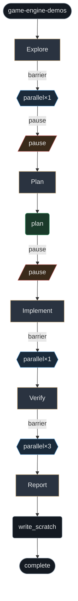

# game-engine-demos

Graph for Scrya adventure stack: NCP storyforms, adventure-engine (Ariadne) runtime, scene-engine locomotion, Flutter Scene sister, demos. Explore → plan → optional worktree implement → cargo/NCP/demo verify → report.

**When:** Upgrade game engine + demos, Shawshank PAC, NCP→RON pipeline, adventure-engine examples, or Dart Scene parity — not single-line widget tweaks.

## Stats

| metric | count |
| --- | --- |
| phases | 5 |
| phase() | 5 |
| agent() | 1 |
| parallel() | 3 |
| complete() | 1 |
| gates | 2 |

## Graph

